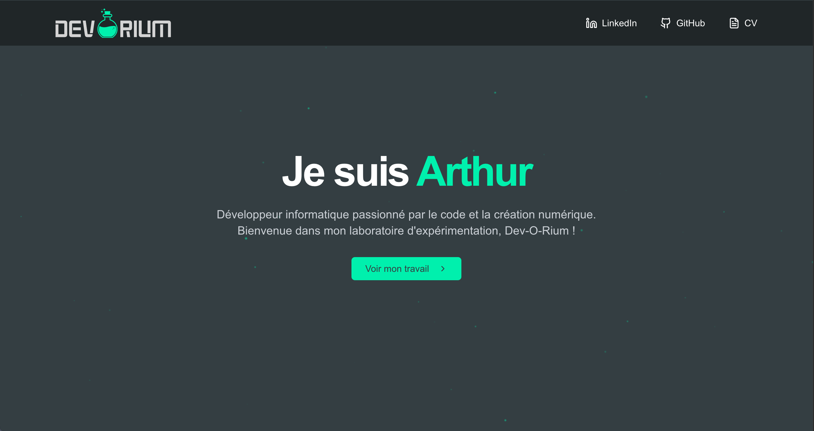

<div align="center">


# Dev-O-Rium

Portfolio personnel d'Arthur Reynet — développeur fullstack React / .NET.

[](https://dev-o-rium.vercel.app)
[](https://nextjs.org)
[](https://react.dev)
[](https://www.typescriptlang.org)
[](https://tailwindcss.com)

</div>

---

## Aperçu



## Stack

- **Framework** : Next.js 15 (App Router, Turbopack)
- **Langage** : TypeScript 5 (strict mode)
- **UI** : React 19, Tailwind CSS, shadcn/ui (Radix Slot + CVA)
- **Animations** : Framer Motion, Canvas 2D (particules custom)
- **Carrousel** : Embla Carousel
- **Icônes** : Lucide React
- **Qualité** : ESLint (flat config) + Prettier

## Fonctionnalités

- **Hero animé** — arrière-plan particulaire rendu sur `<canvas>` (`requestAnimationFrame`)
- **Carrousel de projets** — navigation clavier + dots, via Embla
- **Section Skills** — grille catégorisée (Frontend / Backend / Autres)
- **Section Contact** — formulaire contrôlé + arrière-plan "circuit" animé
- **Navbar adaptative** — menu desktop / drawer mobile, blur au scroll
- **Responsive** mobile-first, thème sombre

## Démarrage

Prérequis : **Node.js ≥ 20** (recommandé : 24 via `nvm use`).

```bash
# 1. Cloner
git clone https://github.com/ArthurReynet1/Dev-O-Rium.git
cd Dev-O-Rium

# 2. Installer
npm install

# 3. Lancer en dev (Turbopack)
npm run dev
```

Ouvrir [http://localhost:3000](http://localhost:3000).

## Scripts

| Script                 | Description                   |
| ---------------------- | ----------------------------- |
| `npm run dev`          | Serveur de dev avec Turbopack |
| `npm run build`        | Build de production           |
| `npm run start`        | Lancer le build de production |
| `npm run lint`         | Linter le code                |
| `npm run format`       | Formater avec Prettier        |
| `npm run format:check` | Vérifier le formatage         |

## Structure du projet

```
src/
├── app/                    # App Router (layout, page, globals)
│   ├── layout.tsx          # Metadata, fonts Geist
│   ├── page.tsx            # Composition des sections
│   └── globals.css         # Variables CSS + Tailwind
├── components/
│   ├── Navbar/             # Navbar + Desktop/Mobile menus
│   ├── Sections/           # Sections de la home
│   │   ├── Hero/           # Canvas particules + CTA
│   │   ├── Projects/       # Carrousel Embla
│   │   ├── Skills/         # Grille compétences
│   │   └── Contact/        # Formulaire + CircuitBackground
│   └── ui/                 # Primitives (Button shadcn, CircuitBackground)
└── lib/
    └── utils.ts            # Helper `cn()` (clsx + tailwind-merge)
```

## Déploiement

Déployé sur **Vercel** (branche `develop` → production).

```bash
# Déploiement manuel
npx vercel --prod
```

## Auteur

**Arthur Reynet** — Développeur fullstack en alternance (React/Next.js + .NET), ouvert aux missions freelance.

- Portfolio : [dev-o-rium.vercel.app](https://dev-o-rium.vercel.app)
- LinkedIn : [linkedin.com/in/arthur-reynet](https://www.linkedin.com/in/arthurreynet/)
- GitHub : [@ArthurReynet1](https://github.com/ArthurReynet1)
- Email : arthur.reynet@gmail.com

## Licence

MIT © Arthur Reynet
